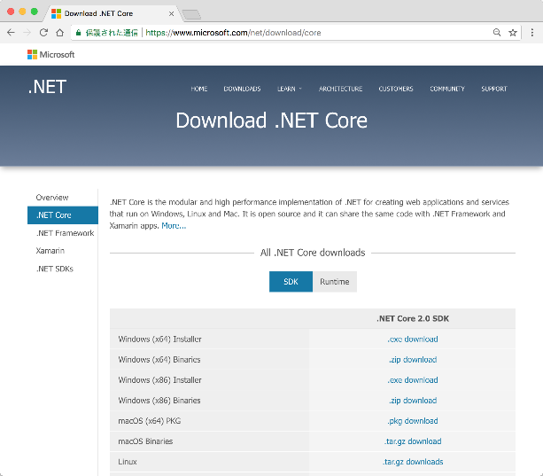
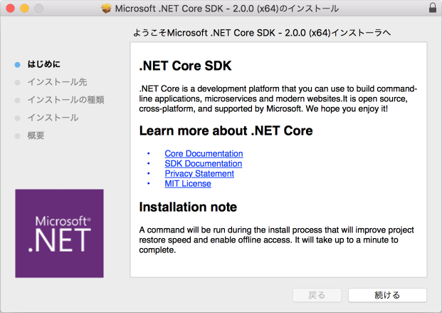
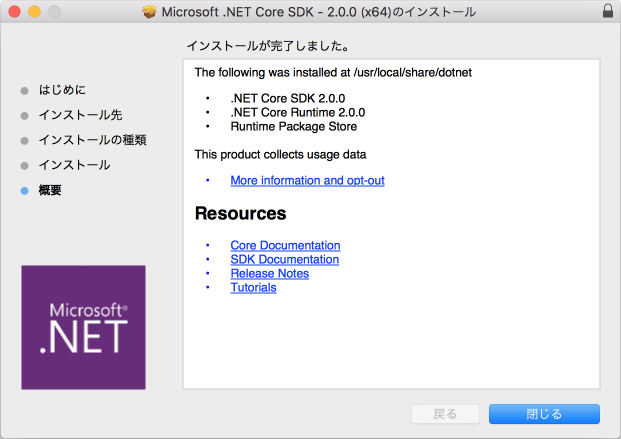

# [Mac環境] .NET Core SDK 2.0 のインストール

## インストーラーのダウンロード

Microsoft .NET の公式サイトから、「.NET Core SDK 2.0」のインストーラーをダウンロードします。  
<https://www.microsoft.com/net/download/core>



※ pkg形式とtar.gz形式がありますが、pkg形式の方をダウンロードしてください。  

[ファイル情報]

・ファイル名： dotnet-sdk-2.0.0-osx-x64.pkg  
・ファイルサイズ： 約140MB


## インストール

ダウンロードしたインストーラーを実行します。  
ウィザードの案内に従って進めます。  
(途中、インストール先の指定画面がありますが、デフォルトのままで問題ありません)  



以下の画面が表示されれば、インストール処理は完了です。



インストール直後の状態だと、.NET Core SDK のコマンドラインツール「dotnet」にパスが通っていません。  
ターミナルから以下のコマンドを実行して、シンボリックリンクを作成します。

```
$ ln -s /usr/local/share/dotnet/dotnet /usr/local/bin/
```


## インストール後の確認

ターミナルから、以下のコマンドを実行します。

```
$ dotnet --info
```

以下のように表示されれば正しくインストールされています。

```
.NET コマンド ライン ツール (2.0.0)

Product Information:
 Version:            2.0.0
 Commit SHA-1 hash:  cdcd1928c9

Runtime Environment:
 OS Name:     Mac OS X
 OS Version:  10.13
 OS Platform: Darwin
 RID:         osx.10.12-x64
 Base Path:   /usr/local/share/dotnet/sdk/2.0.0/

Microsoft .NET Core Shared Framework Host

  Version  : 2.0.0
  Build    : e8b8861ac7faf042c87a5c2f9f2d04c98b69f28d
```


## .NET Core SDK の簡易な動作確認

コマンドプロンプト または PowerShell を起動して、アプリケーションを作成するフォルダへ移動します。  
(例：「~/Projects」)

```
$ cd ~/Projects
```

以下のコマンドを実行して、.NET Core のプロジェクトテンプレートを作成します。  
今回は「コンソールアプリ」のテンプレートを使用します。

```
Projects$ dotnet new console -o myapp
```

「myapp」フォルダが作成されているので、移動します。

```
Projects$ cd myapp
```

C#ファイルなど、いくつかのファイルが生成されていることが確認できます。

```
myapp$ ls -l
total 16
-rw-r--r--  1 user  staff  187 10  5 12:52 Program.cs
-rw-r--r--  1 user  staff  178 10  5 12:52 myapp.csproj
drwxr-xr-x  6 user  staff  192 10  5 12:52 obj
```

中身を見てみましょう。

```
myapp$ cat Program.cs 
using System;

namespace myapp
{
    class Program
    {
        static void Main(string[] args)
        {
            Console.WriteLine("Hello World!");
        }
    }
}
```

このように、テンプレートの内容は「サンプルプログラム」的なソースコードが記述されたものとなっています。  
テンプレートを修正したり、新たなファイルを追加したりして、開発を行って行きます。

今回は、生成されたテンプレートから特に変更せずに、アプリケーションを実行してみましょう。  
「dotnet run」コマンドは、アプリケーションのビルドと実行をまとめて行ってくれるコマンドです。

```
myapp$ dotnet run
Hello World!
```

上のように出力されていれば、成功です。

これで「.NET Core SDK 2.0」の準備ができました！！
